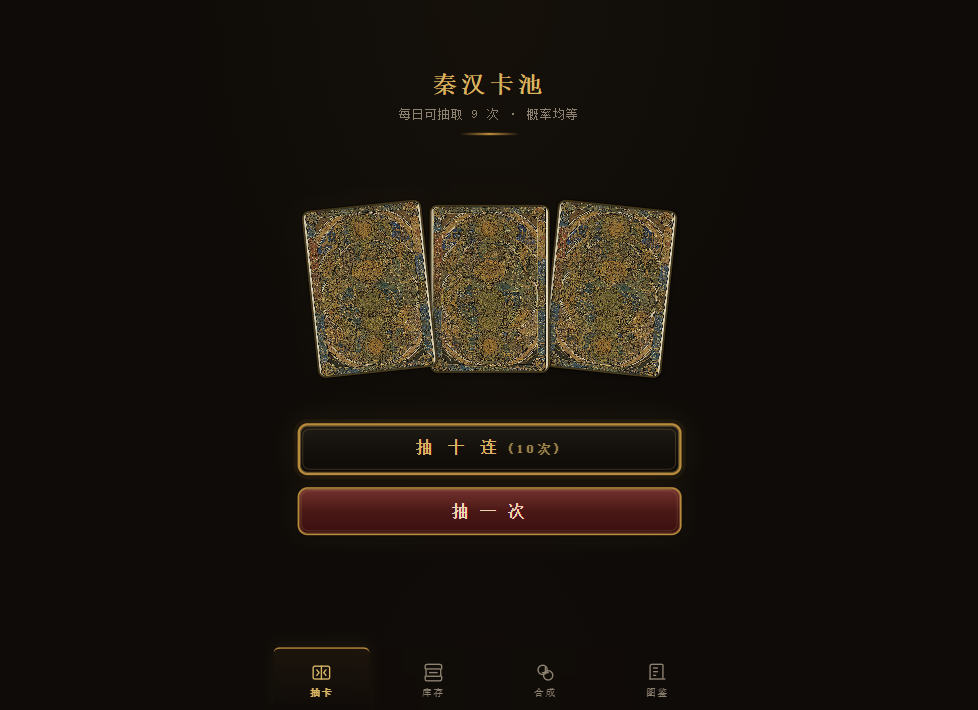
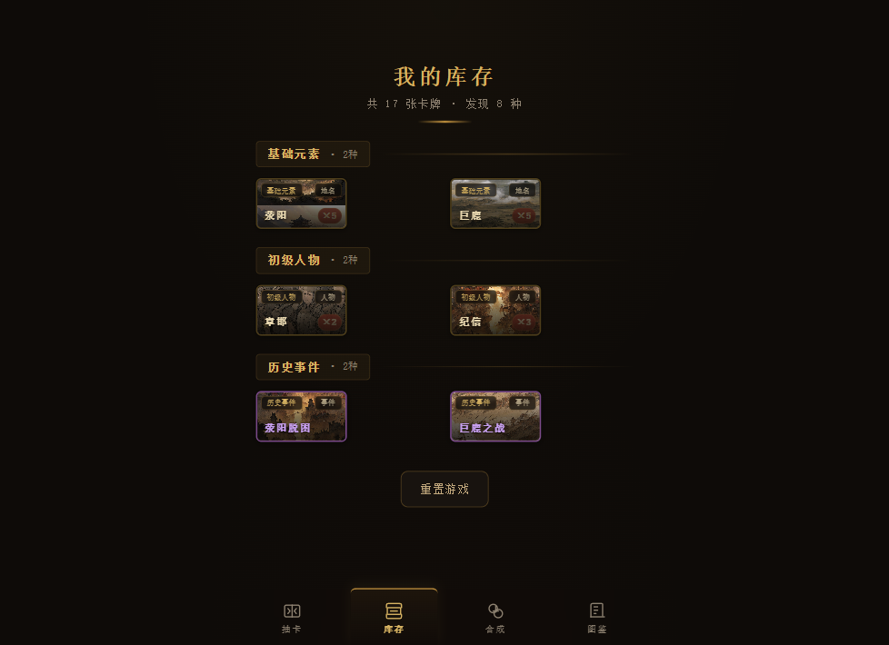
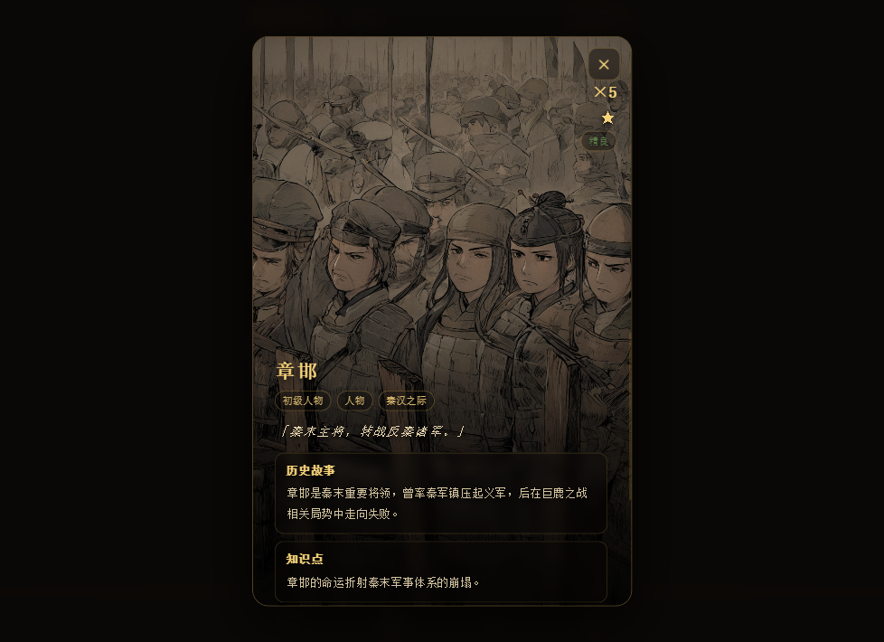
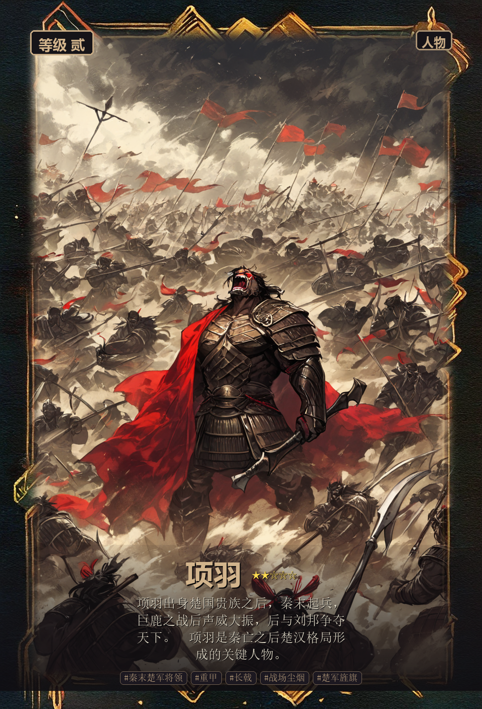
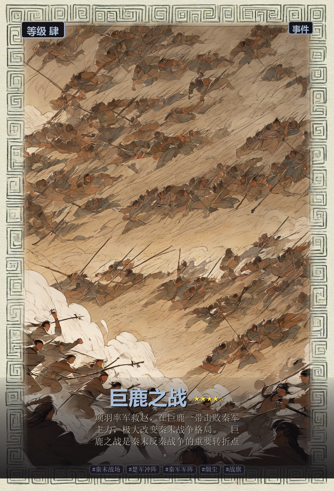
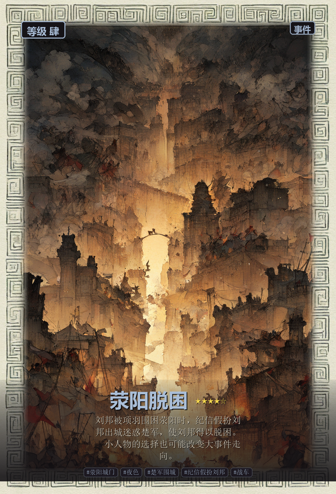
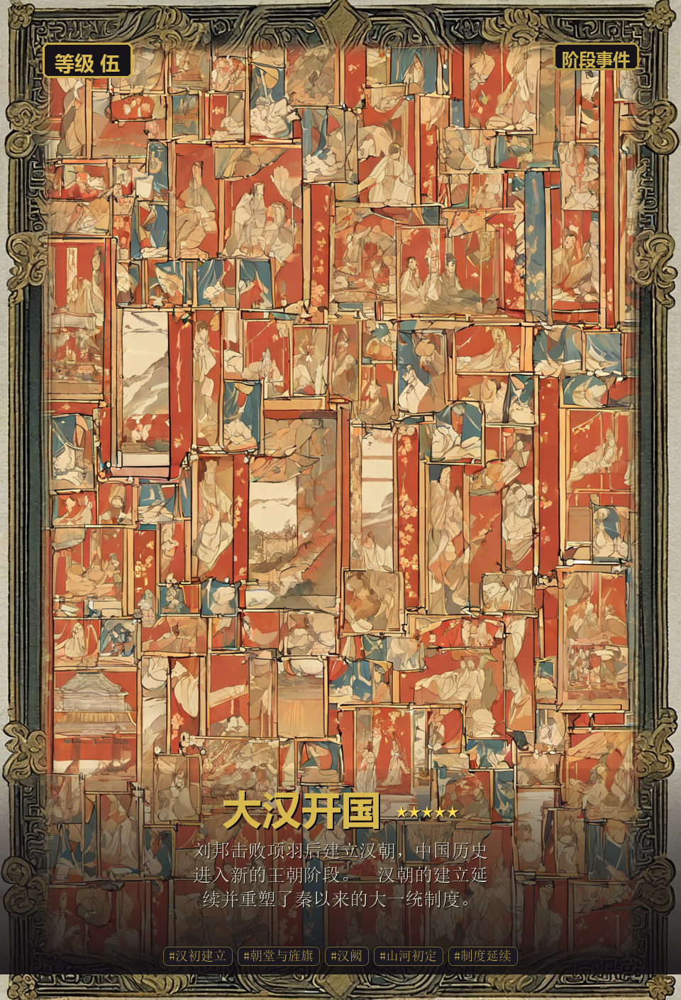
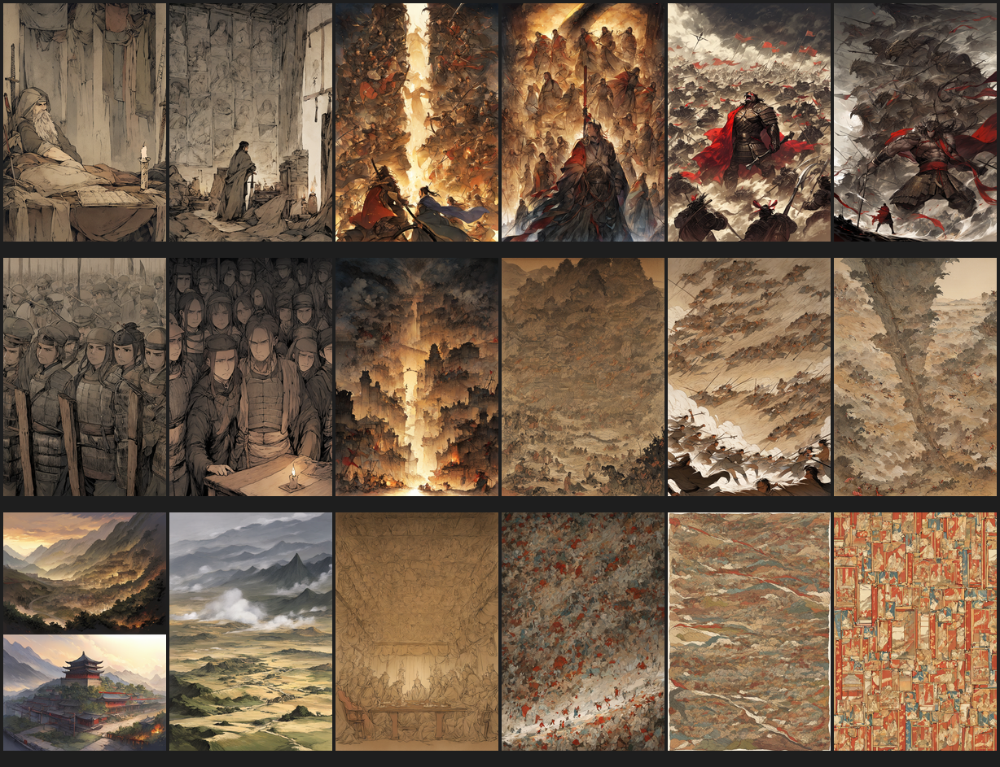

# 国风炼金卡牌

一个以中国历史人物、事件和因果关系为核心的国风卡牌合成收集游戏原型。

玩家通过抽卡获得历史人物、地名与事件卡，再依据真实历史关系进行合成，逐步解锁更高阶的历史事件链。当前 MVP 聚焦“秦汉篇 / 楚汉战争”，验证从抽卡、库存、合成到图鉴解锁的完整闭环。

> Product prototype for a Chinese-history themed collectible card game, combining frontend interaction, historical content design, and AI-assisted card asset generation.

## 项目展示

### 前端原型

| 抽卡界面 | 库存界面 | 卡牌详情 |
| --- | --- | --- |
|  |  |  |

### 卡牌素材

| 项羽 | 巨鹿之战 | 荥阳脱困 | 大汉开国 |
| --- | --- | --- | --- |
|  |  |  |  |



## 核心体验

- 抽卡：从“秦汉卡池”中获得人物、地点、事件等基础卡牌。
- 收集：库存页按历史类别组织卡牌，展示数量、稀有度和已发现内容。
- 合成：用历史关系驱动合成，而不是简单数值堆叠。
- 图鉴：每张卡牌都包含历史故事、知识点、相关卡牌和合成线索。
- 资产：本地 ComfyUI 生成卡面原画，再由前端叠加等级、类型、边框与文案。

## MVP 历史链路

当前验证线采用“秦汉篇 / 楚汉战争”：

```text
刘邦 + 纪信 -> 荥阳脱困
项羽 + 章邯 -> 巨鹿之战
荥阳脱困 + 鸿门宴 -> 楚汉相争
楚汉相争 + 垓下之围 -> 大汉开国
```

这条链路的设计重点是让合成行为本身成为历史理解过程：玩家不是把两张材料卡消耗掉，而是在发现人物关系、战役前因和时代转折。

## 技术与设计亮点

- React + TypeScript + Vite 实现可运行移动端原型。
- Zustand 管理抽卡、库存、图鉴、合成等核心状态。
- Framer Motion 实现抽卡、卡牌翻转、弹窗与页面反馈动画。
- 配置化卡牌、抽卡池、每日限制和合成规则，便于扩展到更多朝代篇章。
- 本地 ComfyUI 资产生成流程，保留 prompt、workflow、候选图和生成记录。
- 卡牌文字由结构化数据和 UI 叠加，避免图片生成模型产生不可控文字。

## 项目结构

```text
prototype/                  React + TypeScript 前端原型
config/                     卡牌、合成、抽卡、每日限制等配置
docs/                       玩法、数据模型、素材生成和 UI 规范文档
docs/showcase/              GitHub 首页展示截图
assets-source/prompts/      卡牌原画与 ComfyUI 生成提示词
assets/cards/samples/       第一轮本地 ComfyUI 样张
assets-output/cards/        成品卡面、缩略图、workflow 与联系表
scripts/                    ComfyUI 批量生成与素材联系表脚本
策划案/                     项目整体策划案
```

## 本地运行

```powershell
cd prototype
npm install
npm run dev
```

构建检查：

```powershell
cd prototype
npm run lint
npm run build
```

## 素材生成

本项目的卡牌样张通过 Windows 本地 ComfyUI 生成，不依赖外部图片生成服务。

```powershell
python scripts\comfyui_generate_card_samples.py --dry-run
python scripts\comfyui_generate_card_samples.py
python scripts\comfyui_make_contact_sheet.py
```

更完整的流程记录见 [ComfyUI 本地生成说明](docs/comfyui-local-generation.md)。

## 当前阶段

项目处于 MVP 原型验证阶段，已完成：

- 核心玩法闭环：抽卡、库存、合成、图鉴、详情页。
- 首批楚汉主题卡牌数据与文案。
- 第一轮本地 AI 卡牌素材生成与展示。
- 面向移动端的国风游戏 UI 风格验证。

后续计划：

- 扩展更多历史篇章与卡牌链路。
- 优化卡牌稀有度、成长、每日奖励与长期留存。
- 增加音效、转场、卡牌获得仪式感和更完整的新手引导。
- 接入真实小游戏运行环境与数据持久化方案。

## 项目价值

这个原型展示了一个从 0 到 1 的完整产品能力链路：题材定位、玩法设计、数据建模、前端实现、视觉资产生成、文档沉淀与可运行验证。它既是一个游戏创意原型，也是一个可扩展的历史知识互动产品雏形。
