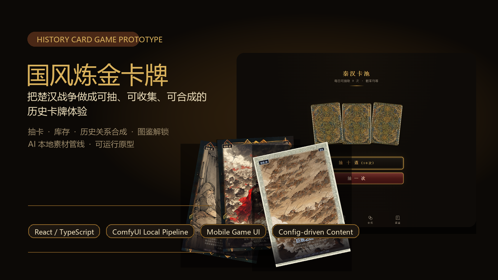
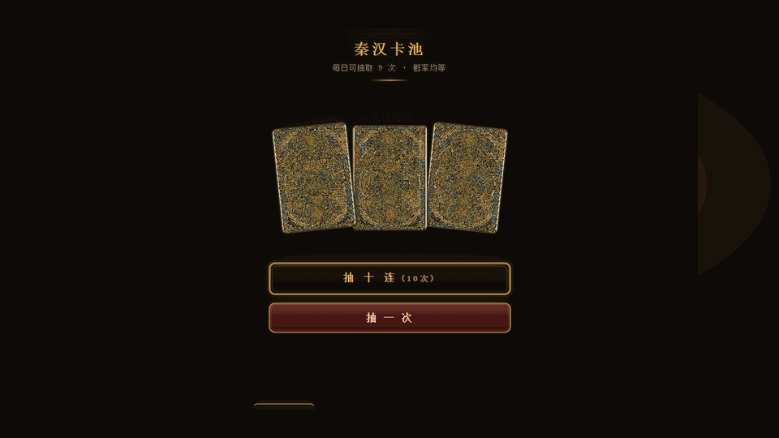
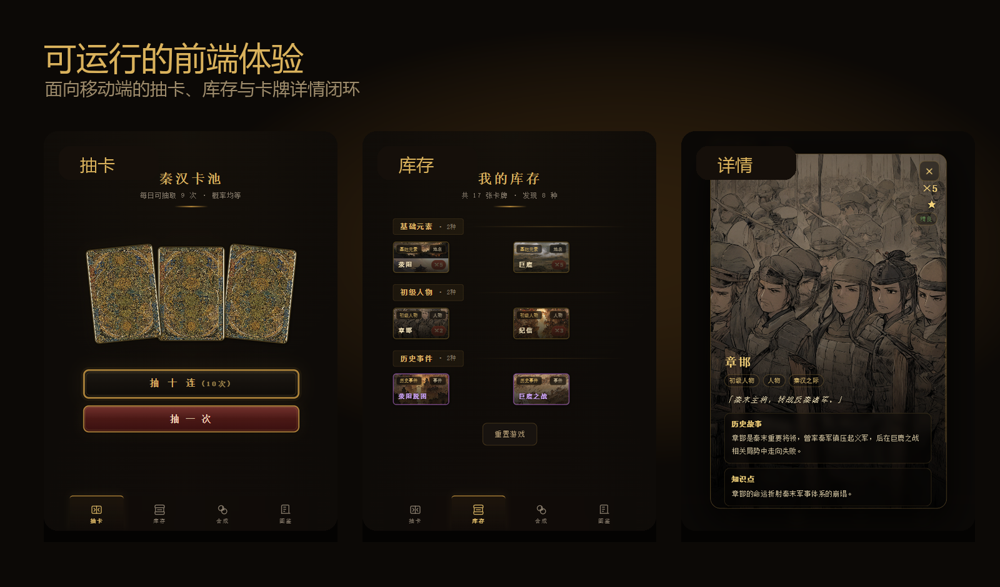
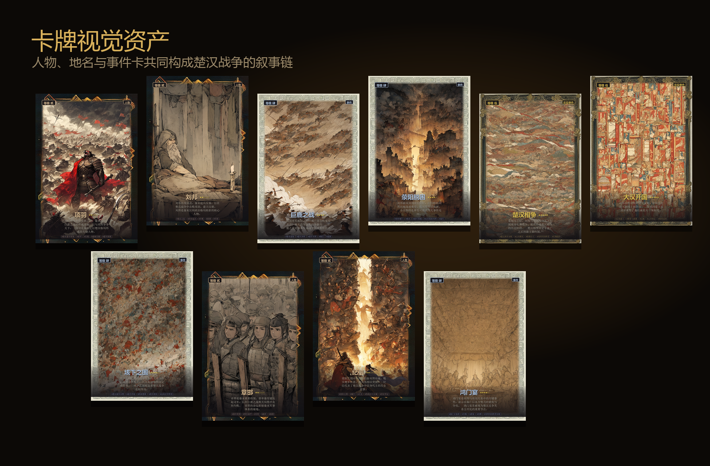
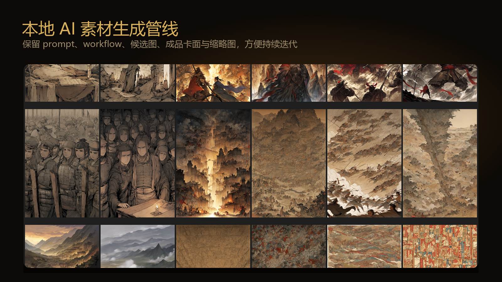

# 国风炼金卡牌

<p align="center">
  
</p>

<p align="center">
  <strong>把楚汉战争做成可抽、可收集、可合成的历史卡牌体验。</strong>
  <br />
  React / TypeScript 可运行前端原型 · 本地 ComfyUI 卡牌素材管线 · 配置化历史内容系统
</p>

<p align="center">
  
</p>

## 展示面

<p align="center">
  
</p>

<p align="center">
  
</p>

<p align="center">
  
</p>

## 项目一句话

《国风炼金卡牌》是一个以中国历史人物、地名、事件和因果关系为核心的卡牌合成收集游戏原型。玩家通过抽卡获得基础卡牌，再根据真实历史关系进行合成，逐步解锁更高阶的历史事件链。

当前 MVP 聚焦“秦汉篇 / 楚汉战争”，验证从抽卡、库存、历史关系合成到图鉴解锁的完整闭环。

## 核心玩法

```text
刘邦 + 纪信 -> 荥阳脱困
项羽 + 章邯 -> 巨鹿之战
荥阳脱困 + 鸿门宴 -> 楚汉相争
楚汉相争 + 垓下之围 -> 大汉开国
```

- 抽卡：从“秦汉卡池”中获得人物、地点、事件等基础卡牌。
- 库存：按历史类别组织卡牌，展示数量、稀有度和已发现内容。
- 合成：以历史关系驱动合成，而不是简单材料消耗。
- 图鉴：每张卡牌包含历史故事、知识点、相关卡牌和合成线索。
- 素材：本地 ComfyUI 生成原画，前端叠加等级、类型、边框与文案。

## 技术亮点

- React + TypeScript + Vite 实现可运行移动端原型。
- Zustand 管理抽卡、库存、图鉴、合成等核心状态。
- Framer Motion 实现抽卡、卡牌翻转、弹窗与页面反馈动画。
- 配置化卡牌、抽卡池、每日限制和合成规则，便于扩展到更多朝代篇章。
- 本地 ComfyUI 资产生成流程，保留 prompt、workflow、候选图、成品卡面和生成记录。
- 卡牌文字由结构化数据和 UI 叠加，避免图片生成模型产生不可控文字。

## 项目结构

```text
prototype/                  React + TypeScript 前端原型
config/                     卡牌、合成、抽卡、每日限制等配置
docs/                       玩法、数据模型、素材生成和 UI 规范文档
docs/showcase/              GitHub 首页展示图与动图
assets-source/prompts/      卡牌原画与 ComfyUI 生成提示词
assets/cards/samples/       第一轮本地 ComfyUI 样张
assets-output/cards/        成品卡面、缩略图、workflow 与联系表
scripts/                    ComfyUI 批量生成与素材联系表脚本
策划案/                     项目整体策划案
```

## 本地运行

```powershell
cd prototype
npm install
npm run dev
```

构建检查：

```powershell
cd prototype
npm run lint
npm run build
```

## 素材生成

```powershell
python scripts\comfyui_generate_card_samples.py --dry-run
python scripts\comfyui_generate_card_samples.py
python scripts\comfyui_make_contact_sheet.py
```

完整流程见 [ComfyUI 本地生成说明](docs/comfyui-local-generation.md)。

## 项目价值

这个原型展示了从 0 到 1 的完整产品能力链路：题材定位、玩法设计、数据建模、前端实现、视觉资产生成、文档沉淀与可运行验证。它既是一个游戏创意原型，也是一个可扩展的历史知识互动产品雏形。
