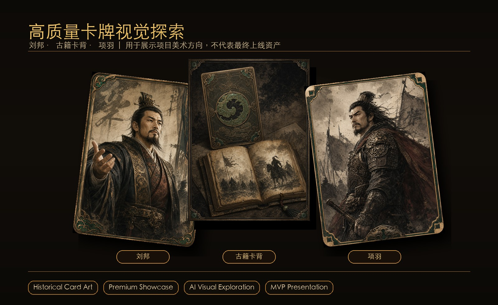

# 国风炼金卡牌

> 面向抖音小游戏的竖屏国风历史卡牌收集项目。以中国历史人物、历史事件、兵器、典籍与朝代主题卡池为核心，构建“抽卡 + 合成 + 收集 + 升星 + 周期运营”的轻量卡牌闭环。

<p align="center">
  
</p>

<p align="center">
  <strong>把楚汉战争做成可抽、可收集、可合成的历史卡牌体验。</strong>
  <br />
  Cocos Creator 客户端工程 · H5 视觉原型 · 本地 AI 卡牌素材管线 · 配置化历史内容系统
</p>

<p align="center">
  
</p>

[](#技术栈)
[](#技术栈)
[](#项目定位)
[](#当前进度)
[](#数据与内容体系)

## 项目定位

《国风炼金卡牌》不是修仙炼丹模拟器，而是一款以中国历史知识与卡牌收集驱动的国风小游戏。“炼金”在本项目中作为品牌词，具体落到卡牌合成、碎片转化、重复卡升星、低阶卡熔合与图鉴进度成长。

首版目标聚焦一个清晰、可验证、可运营的 MVP 闭环：

```text
进入游戏
  -> 查看本周朝代主题卡池
  -> 免费抽卡 / 普通抽卡 / 高级抽卡
  -> 获得人物卡、事件卡、碎片或低阶卡
  -> 新卡点亮卡册
  -> 重复卡转化为碎片或升星材料
  -> 碎片足够后合成指定卡
  -> 推进本周主题收集进度
  -> 领取周期收集奖励
  -> 下周进入新朝代卡池
```

## 核心亮点

- **历史卡牌化**：把刘邦、项羽、纪信、鸿门宴、巨鹿之战、楚汉相争等历史内容转化为可收集、可合成、可解锁的卡牌资产。
- **周期朝代卡池**：以唐、宋、明、三国、秦汉、春秋战国等主题做周轮换，形成持续回访与运营节奏。
- **关系合成链**：合成不是简单数值升级，而是通过人物、地点、事件之间的历史关系生成更高阶事件卡。
- **重复卡价值闭环**：重复卡进入碎片、升星、同朝代收集进度与长期养成，避免“抽到重复就浪费”的体验。
- **配置驱动工程**：卡牌、卡池、合成、每日限制、周期奖励等玩法参数均以 JSON 配置为入口，后续可平滑迁移到后台管理系统。
- **AI 素材生产预留**：保留 ComfyUI / prompt 工作流，用于批量生成国风人物卡、事件卡、卡背与朝代主题视觉资产。

## 项目展示

<p align="center">
  
</p>

<p align="center">
  
</p>

<p align="center">
  
</p>

<p align="center">
  
</p>

## 当前进度

| 模块 | 状态 | 说明 |
| --- | --- | --- |
| 产品策划 | 已建立 | 总策划案、MVP 范围、技术栈、数据模型与后续路线已拆分到文档目录 |
| Cocos 客户端 | 原型中 | 已创建 Cocos Creator 3.8.8 工程，具备配置加载、抽卡、库存、合成、升星、图鉴进度等核心脚本骨架 |
| 配置数据 | 原型中 | 已有秦汉 / 楚汉样例卡牌、周期卡池、合成规则、重复转化、朝代标签与周奖励配置 |
| H5 视觉原型 | 参考中 | 保留 Next.js H5 原型作为视觉与交互参考，不作为最终抖音小游戏客户端 |
| 后端服务 | 规划中 | 用户、抽卡、背包、卡册、任务、支付、广告奖励、运营后台等模块已规划，尚未接入生产后端 |
| AI 素材管线 | 规划中 | 已有卡牌风格 prompt 基线，后续接 ComfyUI 批量出图与资源入库 |

## 技术栈

### 游戏客户端

- Cocos Creator 3.8.8
- TypeScript
- 竖屏移动端 UI
- 目标平台：抖音小游戏
- 后续兼容方向：Web / 微信小游戏

### 数据与配置

- JSON 配置作为 MVP 数据源
- 卡牌母表：`config/cards.json`
- 卡池配置：`config/draw_pools.json`
- 合成规则：`config/merge_rules.json`
- 每日限制：`config/daily_limits.json`
- 重复转化：`config/duplicate_conversion_rules.json`
- 朝代标签：`config/dynasty_tags.json`
- 周期奖励：`config/weekly_collection_rewards.json`

### 后端预留

- Node.js + TypeScript
- NestJS 或 Fastify
- PostgreSQL
- Redis
- 对象存储 / CDN
- 运营配置后台

## 仓库结构

```text
.
├── README.md
├── config/                         # MVP 配置数据
├── docs/                           # 产品、技术、架构与路线文档
├── assets-source/                  # AI 素材生产提示词与源资产规范
├── client/
│   └── cocos-client/               # Cocos Creator 3.8.8 客户端工程
├── 版本 1/
│   └── guofenglianjin/             # H5 视觉原型与交互参考
└── 策划案/
    └── 国风炼金卡牌-项目整体策划案.md
```

## Cocos 客户端模块

```text
client/cocos-client/assets/scripts/
├── core/
│   ├── ConfigLoader.ts             # 读取 resources/config 下的 JSON 配置
│   └── EventBus.ts                 # 轻量事件分发
├── data/
│   └── CardTypes.ts                # 卡牌、卡池、库存、合成、图鉴类型定义
├── managers/
│   ├── CardManager.ts              # 卡牌目录缓存与查询
│   ├── DrawManager.ts              # 抽卡逻辑
│   ├── InventoryManager.ts         # 本地库存状态
│   ├── MergeManager.ts             # 历史关系合成
│   ├── StarManager.ts              # 重复卡升星
│   └── CollectionManager.ts        # 图鉴解锁与进度
└── ui/
    ├── AppRoot.ts                  # 客户端启动入口
    └── pages/HomePage.ts           # MVP 首页原型
```

## 数据与内容体系

MVP 样例线采用“秦汉篇 / 楚汉战争”作为第一条验证链：

- `刘邦 + 纪信 -> 荥阳脱困`
- `项羽 + 章邯 -> 巨鹿之战`
- `荥阳脱困 + 鸿门宴 -> 楚汉相争`
- `楚汉相争 + 垓下之围 -> 大汉开国`

配置设计原则：

- 低阶卡也必须服务当前朝代主题，不投放无关杂牌。
- 每张卡保留历史简介、知识点、相关卡、合成提示与资源路径。
- 卡池支持常驻基础池、周期朝代池、限时高级池三层结构。
- 所有概率、奖励、卡池轮换与消耗规则优先进入配置表。

## 文档入口

- [项目总策划案](./策划案/国风炼金卡牌-项目整体策划案.md)
- [MVP 范围](./docs/mvp-scope.md)
- [技术栈与工程模块](./docs/technical-stack.md)
- [系统架构](./docs/architecture.md)
- [数据配置系统](./docs/data-model.md)
- [Cocos 前端结构](./docs/frontend-structure.md)
- [产品路线图](./docs/roadmap.md)
- [后续开发顺序](./docs/next-steps.md)
- [视觉设计说明](./docs/design.md)
- [卡牌 AI 出图风格基线](./assets-source/prompts/card-art-style.md)

## 快速开始

### 1. 克隆仓库

```bash
git clone https://github.com/Ai-Rider-WinGo/guofeng-alchemy-card.git
cd guofeng-alchemy-card
```

### 2. 打开 Cocos 客户端

使用 Cocos Dashboard / Cocos Creator 3.8.8 打开：

```text
client/cocos-client
```

运行场景：

```text
client/cocos-client/assets/scene.scene
```

### 3. 查看 H5 原型参考

H5 原型仅用于视觉与交互参考：

```bash
cd "版本 1/guofenglianjin"
npm install
npm run dev
```

## 开发原则

- 先做小卡池真闭环，再扩展全量历史内容。
- 先验证抽卡、库存、合成、卡册、奖励，再进入复杂战斗。
- 低级卡必须是有历史知识点的内容资产，而不是纯材料。
- 合成必须解释历史关系，不能只给数值结果。
- 经济参数、概率与活动节奏进入配置，不硬编码在 UI。
- “古籍炼炉”可作为合成视觉母题，但产品主线仍是历史卡牌收集。

## 暂缓范围

- 复杂 PVP
- 公会
- 交易市场
- 装备系统
- 大地图探索
- 修仙洞府系统
- 重世界观长动画
- 生产级支付、广告、运营后台

## License

当前项目处于产品原型与 MVP 工程阶段，暂未声明开源许可证。未经项目维护者许可，请勿将素材、策划案或配置数据用于商业发布。
